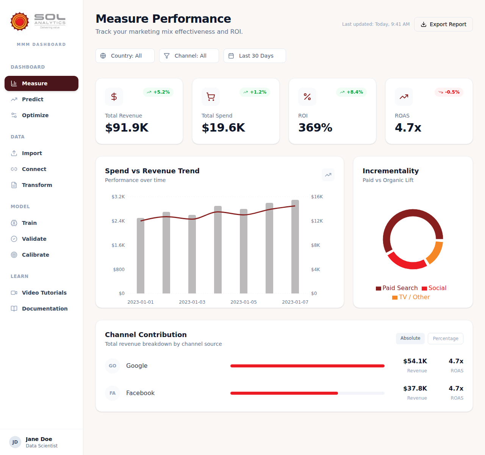
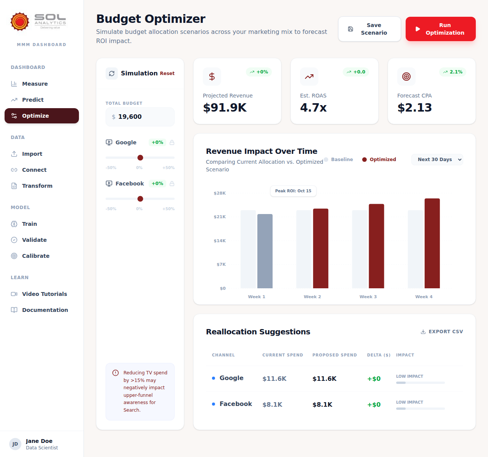
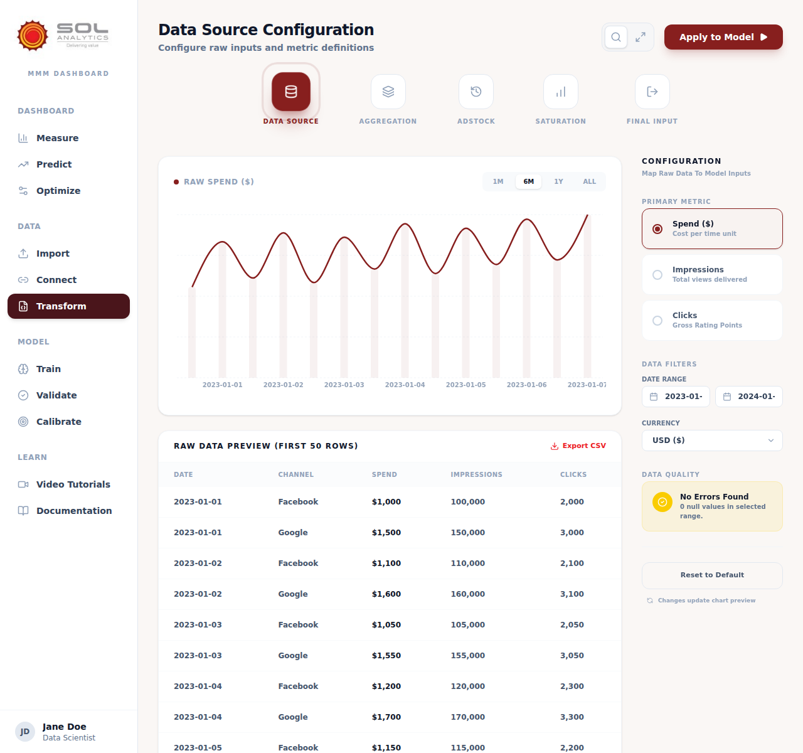

# MMM Dashboard | Sol Analytics



## Overview
Welcome to the **MMM Dashboard | Sol Analytics**, a comprehensive Marketing Mix Modeling (MMM) solution designed specifically for marketing managers. Our platform empowers you to make data-driven decisions by quantifying the impact of your marketing channels on revenue, optimizing budget allocations, and forecasting future performance with precision.

Sol Analytics bridges the gap between complex statistical modeling and actionable marketing insights, providing a user-friendly interface to manage the entire MMM lifecycle.

---

## Key Features

### 📊 Performance Measurement
*   **Omnichannel Tracking:** Get a unified view of ROI and ROAS across all your marketing channels (Facebook, Google, etc.).
*   **Contribution Analysis:** Understand exactly how much each channel contributes to your total revenue.
*   **Incrementality Insights:** Distinguish between organic growth and paid lift with advanced incrementality charts.

### 📈 Predictive Forecasting
*   **What-If Analysis:** Simulate various spend scenarios to see how they impact your future revenue and ROI.
*   **Trend Analysis:** Visualize predicted performance trends over time to plan your marketing calendar effectively.

### ⚖️ Budget Optimization
*   **Smart Reallocation:** Use our optimization engine to find the most efficient way to distribute your budget for maximum impact.
*   **Impact Simulation:** Adjust sliders for each channel to see real-time updates on projected revenue and CPA.

### 🛠️ Data & Model Management
*   **Seamless Import:** Easily upload your marketing data via CSV with automatic schema detection and validation.
*   **Advanced Transformations:** Apply Adstock (decay) and Saturation (diminishing returns) transformations to accurately reflect marketing dynamics.
*   **Model Calibration:** Calibrate your models using lift studies and experimental data for increased accuracy.

---

## Screenshots

### Executive Dashboard (Measure)
Track your high-level KPIs and channel performance at a glance.


### Budget Optimizer
Find the perfect balance for your marketing spend.


### Model Training & Transformation
Configure advanced statistical parameters without writing a single line of code.


---

## Getting Started

### Prerequisites
*   [Node.js](https://nodejs.org/) (v18 or higher)
*   npm or yarn

### Installation
1. Clone the repository:
   ```bash
   git clone https://github.com/your-username/mmm-dashboard.git
   cd mmm-dashboard
   ```
2. Install dependencies:
   ```bash
   npm install
   ```

### Running the Dashboard
Start the development server:
```bash
npm run dev
```
Open your browser and navigate to `http://localhost:5173`.

---

## Technologies Used
*   **Frontend:** React 19, TypeScript, Vite
*   **Styling:** Tailwind CSS
*   **Charts:** Recharts
*   **State Management:** Zustand with IndexedDB persistence
*   **Icons:** Lucide React
*   **Data Parsing:** PapaParse

---

© 2026 Sol Analytics. All rights reserved.
