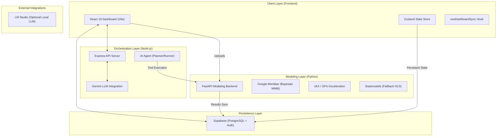

# System Design & Architecture | MMM Sol Analytics

This document provides a technical overview of the **MMM (Marketing Mix Modeling) Dashboard** architecture, highlighting the key components, data flow, and integration patterns.

---

## 🏗️ High-Level Architecture

The system follows a multi-service architecture designed for high-performance statistical modeling and interactive data exploration.

---

## 💻 Core Components

### 1. Frontend: Interactive Analytics Interface
- **Technology**: React 19, TypeScript, Vite, Tailwind CSS 4.
- **Visualization**: `Recharts` for dynamic ROI, contribution, and incrementality plots.
- **State Management**: `Zustand` provides a reactive global state, persisted locally via `IndexedDB` (`idb-keyval`) for handling large marketing datasets (>100k rows) without lag.
- **Auto-Sync**: The `useDashboardSync` custom hook ensures that all UI configurations (mappings, filters, optimization targets) are automatically synced to Supabase.

### 2. Modeling Backend: Meridian Engine (Python)
- **Core Logic**: A dedicated `FastAPI` service located in `/backend`.
- **MMM Framework**: Uses **Google Meridian**, a state-of-the-art Bayesian MMM library.
- **Hardware Acceleration**: Built on `JAX`, leveraging GPU acceleration for heavy MCMC (Markov Chain Monte Carlo) sampling.
- **Resiliency**: Implements an `OLS Fallback` mechanism for datasets that are too small or irregular for complex Bayesian modeling.
- **Data Integrity**: Automatically handles time-series aggregation and fills temporal gaps to prevent common modeling errors ("Time coordinates not regularly spaced").

### 3. AI Agent Backend (Node.js)
- **Pattern**: Implements a **Planner / Runner** architecture for complex multi-step reasoning.
- **LLM Core**: Primarily uses Google Gemini for task planning and execution.
- **Capabilities**:
    - **Task Creation**: Generates a structured roadmap based on user natural language queries.
    - **Streaming Execution**: Provides real-time feedback via SSE (Server-Sent Events).
    - **Tools**: Custom tools in `server/agent/tools.ts` allow the agent to query the modeling backend, perform budget simulations, and generate insights.

### 4. Persistence & Integration
- **Supabase**: Serves as the central "Source of Truth" for:
    - Processed modeling results (`dashboard_state` table).
    - User-defined budget scenarios.
    - Agent conversation history and memory.

---

## 🔄 Data Lifecycle

1.  **Ingestion**: User uploads raw marketing/sales data (CSV) via the `Connect` page.
2.  **Validation**: The Python backend performs fuzzy schema detection to map time, KPI (revenue), and media spend columns.
3.  **Modeling**: 
    - Dataset < 52 weeks → **OLS Regression** (Instant).
    - Dataset ≥ 52 weeks → **Meridian Bayesian** (GPU Accelerated).
4.  **Persistence**: Modeling results (coefficients, ROI, chart coordinates) are sanitized and pushed to Supabase.
5.  **Visualization**: The React frontend pulls the latest state from Supabase and renders interactive charts.
6.  **Optimization**: Users interact with the `Optimizer` page, triggering localized simulations or agent-led budget reallocations based on the persisted model parameters.

---

## 🛠️ Tech Stack Overview

| Layer | Technologies |
| :--- | :--- |
| **Frontend** | React 19, TypeScript, Vite, Zustand, Tailwind 4, Recharts |
| **Modeling** | Python 3.10+, FastAPI, Google Meridian, JAX, Statsmodels |
| **Orchestration** | Node.js, Express 5, Gemini API |
| **Persistence** | Supabase (PostgreSQL, Auth, Storage) |
| **Infrastructure** | WSL2 (Ubuntu) for GPU support, Vercel (Frontend Hosting) |
